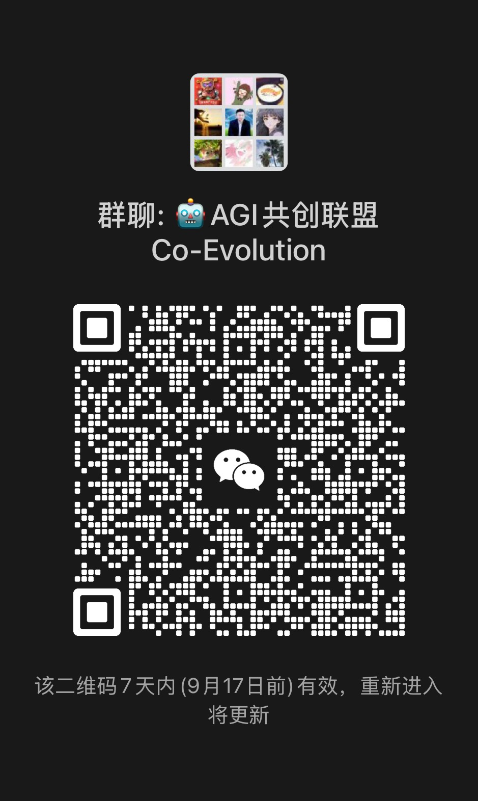

# AGI Co-Evolution (人机共进)

> **集大家的智慧，我们才能走得更远。**  
> 一套由全国各行各业一线伙伴共创共建、面向中小学亲子独立人格塑造与人机共进的实践体系。

---

## 🌟 致同道者：为什么我们要在这里发起共创共建？

这不是一门课程的推销，更不是一份招生广告。  
**这是一份写给所有想在剧变时代里，靠自己的双手和心力做点实事、扎稳脚跟的同行者的邀请函。**

很多人问：*“既然你们已经有一套成熟的打法，并且在很多地方都拿到了非常漂亮的结果，为什么还要大费周章地把体系开源、邀请大家来共创共建？”*

答案其实很简单：  
**虽然我们现在拿到了一些结果，但未来一直在前面等着我们。**  
技术的浪潮一波接着一波，单打独斗的时代早就过去了。一个人就算再聪明、经验再丰富，在时代的巨变面前终究是单薄的。  
唯有汇聚全国各行各业有心力、有执行力的朋友，把每一个真实一线的案例、每一次摸索出的解法融汇在一起，**集大家的智慧，我们才能走得更稳、走得更远。**

---

## 🧭 我们正在做一件什么样的事？

在 AI 人人追求效率、到处充斥着轻资产录播课的当下，我们走了一条看起来最笨、但最管用的路：  
**做中小学的亲子 AI 陪跑服务，并且要求家长必须全程深度参与。**

接触大模型越深，我们越心怀敬畏：**AI 是一把锋利的双刃剑。在起步阶段，绝不能让孩子脱离大人的护航，直接自行处理。**  
这种起步阶段的“约束”，从来不是为了封闭，而是为了未来真正的“精通”。就像学骑马，最初大人必须拉稳缰绳；两代人共同坐在一张桌子前，是在陪伴中建立健康的心智防线与人机协作习惯。

我们之所以做重交付的真人陪伴，是因为标准答案满大街都是，但一个孩子卡住时的迷茫、一个家庭代际沟通的隔阂，需要人与人的真实体温来化解。  
**有了 AI 的加入，我们把这项原本极其昂贵、普通家庭难以触及的高门槛心智重塑服务，做到了每个家庭都能以平实的成本长期受惠。**

---

## 🔑 我们交付的核心：面对复杂现实的“元能力”

我们着重带给孩子的，从来不是死记硬背的考点，而是在真实世界安身立命的**“元能力”**：

* **语言系统（看世界的第一把钥匙）**：  
  语言首先不是为了“说出来”，而是为了“看见”。一个人的语言系统越高级，他对自身情绪与外部世界的分辨率就越高。  
  当孩子只能说“我好烦”时，痛苦是一团模糊的死结；而当他能精准定义出“我不是累，我是边界被侵犯后的愤怒”时，混乱就有了边界。**能够定义痛苦，才是理性解决问题的开始。**  
  * 📖 语言系统教研手记：[《语言系统 —— 孩子看世界的第一把钥匙》（点击查看）](docs/01-看见-脑子里的声音.md)

* **分辨意图（穿透表象的迷雾）**：  
  另一个关键的元能力，是教会孩子**学会“分辨意图”，而不是只停留在“分辨对错好坏”**。  
  真实世界从来不是非黑即白的考卷。批评你的人，真实意图可能只是出于焦虑或害怕失去你；迎合你、提供即时满足的人，真实意图可能正在悄悄收割你的专注力。  
  一个能看清对方真实意图的孩子，无论外界如何喧嚣，都能稳稳立在原地，心如明镜。

---

## 📈 实战验证：从泥潭挣扎，到“优势在我”

这套体系在真实的市场上展现出了极强的生命力与穿透力。在我们过往的陪伴实践中，曾有学生在 4 个月内实现了从 300 分到 650 分的跨越。  
这绝非押中考题的玄学，而是一套清晰的心智重塑逻辑：

当一个孩子在原有体系中陷入持续的挫败时，逼他在泥潭里挣扎往往越陷越深。借助 AI，孩子能够以极快的节奏拿到属于自己的“小成功”与正向反馈：
1. **用极速的小成功，重建掌控感**：体会到局面是可以被自己掌控的，而掌控感是自信心生根发芽的基石；
2. **唤醒目标感，为行为赋予意义**：看懂“我今天坐在这里，不是为了应付谁的考卷，而是为了我自己的人生”，被动受刑转化为主动破局；
3. **在逆境中做到“优势在我”**：在局面全面不利、基础薄弱的情况下，引导孩子跳出盲目跟跑，重新审视自己的特质，找到独特的发力点，实现心力反弹。

* 🎥 团队公开导读指引：[《做新世界的开路人》（点击查看飞书专栏与视频）](https://vcn7cgrvydg7.feishu.cn/wiki/JjvKwq75rijRiTkB76LcoN4bnfb?from=from_wechat)  
  *(注：这是我们在 2024 年录制的一期介绍视频，目前还没有做翻新与更新，但能够比较直观地介绍清楚我们大致在做什么。有兴趣的朋友可以点开看一眼。)*

---

## 🤝 我们的组织机制：进门那一刻，你就是主理人

我们团队里的伙伴来自全国各行各业，很多人过去甚至跟传统的教育行业并无交集。  
**比如我做了 17 年游戏策划，主攻注意力机制的设计与嵌入（也就是人们常说的游戏成瘾机制），在行为心理学方面有所擅长，却从没想过有一天会加入教育这个行业。**  
正是因为跨界的视角，让我们剥离了许多刻板规训，把在真实世界里看懂的商业博弈、规则机制与心智铠甲，系统性地交付给孩子。

在 AGI Co-Evolution 共同体中，实行完全去中心化的共建机制：

1. **人人皆为主理人，主场即老大**：  
   加入团队，你就是这个体系在当地的主理人。今天深圳的伙伴在当地办活动，全国伙伴过去，主场由他负责，所有人叫他“老大”；明天在你的城市操盘，全场以你为主。因为脚踩在当地土地上，眼前的孩子和家庭只有当地伙伴最懂。
2. **零加盟费，门票是“真诚与执行力”**：  
   共同体不收取任何加盟费，也不对你的业务成果做任何抽成。你在本地的所有收获，完全归属于你自己。这里相当于一家全国一线伙伴经验互通、无私托底的教研网络，我们唯一的门票就是伙伴的真诚与执行力。
3. **坦诚说明：我们不保证任何人能赚多少钱**：  
   虽然已有伙伴拿到了非常优异的成果，但我们绝不向任何人承诺收入预期。成熟的打法与经验毫无保留，但个人的成长与事业的达成，始终取决于自身的扎实付出。

---

## 💬 找到我们：让同行的路上不再孤单

如果你也想在自己生活的城市，拥有一份既能踏踏实实帮到别人、又有尊严、能靠自己的努力扎实立足的长期事业；如果你也想找一群不务虚、踏踏实实做实事的同道：

欢迎随时扫码交流，推开这扇门，大家都是主理人。

  <table style="border:none; background:transparent; margin: 0 auto;">
    <tr style="background:transparent; border:none;">
      <td align="center" style="border:none; padding: 20px;">
        
        
<b>个人微信</b> 
        <code>heming1619</code> 
        扫码添加 · 申请引荐加入

      </td>
      <td align="center" style="border:none; padding: 20px;">
        
        
<b>🤖 AGI共创联盟 交流群</b> 
        微信扫码直接进群 
        若群码过期，可添加左侧微信引荐入群

      </td>
    </tr>
  </table>

---

## 📄 许可协议

本项目公开文字材料遵循 [CC BY-NC-SA 4.0 (知识共享-署名-非商业性使用-相同方式共享 4.0 国际许可协议)](LICENSE)。  
守住良知，拒绝倒卖，让教育回归本源。
